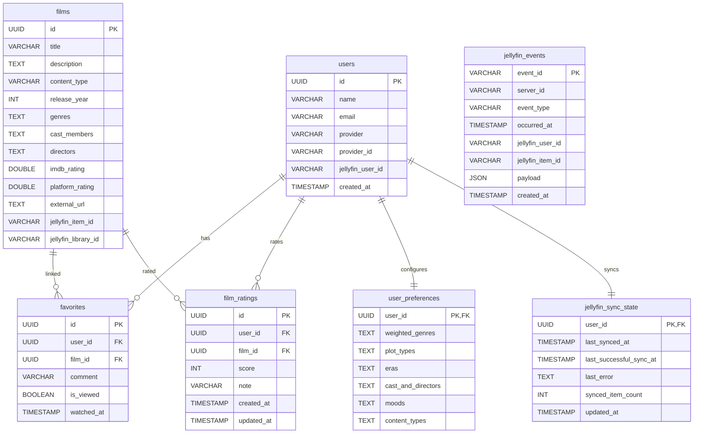

# ER

```mermaid
erDiagram
    users {
        UUID id PK
        VARCHAR name
        VARCHAR email
        VARCHAR provider
        VARCHAR provider_id
        VARCHAR jellyfin_user_id
        TIMESTAMP created_at
    }

    films {
        UUID id PK
        VARCHAR title
        TEXT description
        VARCHAR content_type
        INT release_year
        TEXT genres
        TEXT cast_members
        TEXT directors
        DOUBLE imdb_rating
        DOUBLE platform_rating
        TEXT external_url
        VARCHAR jellyfin_item_id
        VARCHAR jellyfin_library_id
    }

    favorites {
        UUID id PK
        UUID user_id FK
        UUID film_id FK
        VARCHAR comment
        BOOLEAN is_viewed
        TIMESTAMP watched_at
    }

    user_preferences {
        UUID user_id PK,FK
        TEXT weighted_genres
        TEXT plot_types
        TEXT eras
        TEXT cast_and_directors
        TEXT moods
        TEXT content_types
    }

    film_ratings {
        UUID id PK
        UUID user_id FK
        UUID film_id FK
        INT score
        VARCHAR note
        TIMESTAMP created_at
        TIMESTAMP updated_at
    }

    jellyfin_events {
        VARCHAR event_id PK
        VARCHAR server_id
        VARCHAR event_type
        TIMESTAMP occurred_at
        VARCHAR jellyfin_user_id
        VARCHAR jellyfin_item_id
        JSON payload
        TIMESTAMP created_at
    }

    jellyfin_sync_state {
        UUID user_id PK,FK
        TIMESTAMP last_synced_at
        TIMESTAMP last_successful_sync_at
        TEXT last_error
        INT synced_item_count
        TIMESTAMP updated_at
    }

    users ||--o{ favorites : has
    films ||--o{ favorites : linked
    users ||--o{ film_ratings : rates
    films ||--o{ film_ratings : rated
    users ||--|| user_preferences : configures
    users ||--|| jellyfin_sync_state : syncs
```
